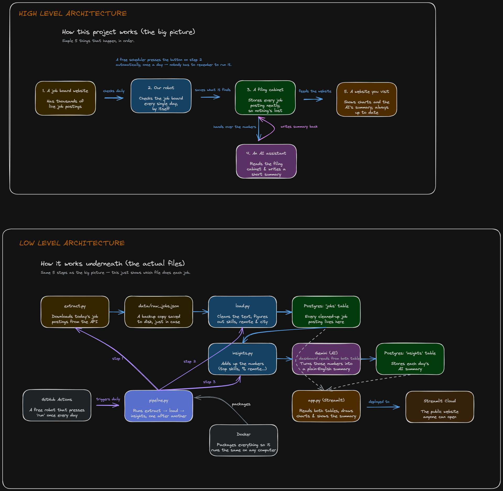

# Tech Job Market Pipeline + AI Insights Dashboard

An end-to-end data pipeline that pulls live tech job postings, stores them in
Postgres, generates AI-written market insights with Gemini, and displays
everything on a public dashboard. Runs automatically every day.

**Live dashboard:** [job-market-pipeline-ishika-wadagbalkar.streamlit.app](https://job-market-pipeline-ishika-wadagbalkar.streamlit.app/)
**Product doc:** [PRD.md](./PRD.md)

## What it does

- Pulls live tech job postings daily from the [Arbeitnow](https://arbeitnow.com/api/job-board-api) API
- Extracts structured signal (technical skills, location, remote status) from raw listing text
- Loads everything into Postgres (Neon), fully idempotent - safe to re-run any time
- Sends aggregated stats to Gemini, which generates a plain-language market summary
- Displays metrics, charts, and the latest AI insight on a Streamlit dashboard
- Runs unattended every day via GitHub Actions cron - no manual triggering needed

## The Flow

```
Arbeitnow API
      │
      ▼
 extract.py  →  raw JSON snapshot (data/)
      │
      ▼
  load.py    →  clean, extract skills, normalize location/remote
      │
      ▼
Neon Postgres (jobs table)
      │
      ▼
insights.py  →  aggregate stats → Gemini → insights table
      │
      ▼
  app.py     →  Streamlit dashboard (public)

pipeline.py ties extract → load → insights into one run,
triggered daily by .github/workflows/run_pipeline.yml
```

## Architecture



## Stack

| Component        | Tool                        | Why                                   |
| ---------------- | --------------------------- | ------------------------------------- |
| Data source      | Arbeitnow Job Board API     | Free, no auth, no rate limit concerns |
| Database         | Neon (serverless Postgres)  | Free tier, always-on public endpoint  |
| AI insights      | Google Gemini API           | Free tier, generous rate limit        |
| Scheduling       | GitHub Actions cron         | Free, unlimited on public repos       |
| Dashboard        | Streamlit + Community Cloud | Free, deploys straight from GitHub    |
| Containerization | Docker                      | Portable, no "works on my machine"    |

## Repo structure

```
src/
  extract.py    Pull raw postings from the API
  load.py       Transform + upsert into Postgres
  insights.py   Generate the AI market summary
  pipeline.py   Runs extract → load → insights as one job
  app.py        Streamlit dashboard
  schema.sql    Database schema
Dockerfile
.github/workflows/run_pipeline.yml   Daily cron trigger
PRD.md          Product requirements doc
```

## Running it locally

```bash
git clone https://github.com/ishikaM2022/job-market-pipeline.git
cd job-market-pipeline
python -m venv venv
source venv/bin/activate   # Windows: venv\Scripts\activate
pip install -r requirements.txt

cp .env.example .env
# fill in NEON_DATABASE_URL and GEMINI_API_KEY in .env

cp .streamlit/secrets.toml.example .streamlit/secrets.toml
# fill in NEON_DATABASE_URL there too (Streamlit doesn't read .env)

python src/pipeline.py      # run the full pipeline once
streamlit run src/app.py    # launch the dashboard locally
```

### Running via Docker instead

```bash
docker build -t job-market-pipeline .
docker run --env-file .env job-market-pipeline
```

## Design notes worth knowing

- **Idempotent loads:** the `jobs` table upserts on a unique `slug`, so re-running
  the pipeline never creates duplicates.
- **Remote detection:** Arbeitnow's own `remote` flag turned out to be unreliable
  (some postings with `location: "remote"` still had `remote: false`), so
  `is_remote` is derived from both signals, not just the API's field.
- **Skill extraction:** done via keyword-matching against job descriptions, not
  the API's `tags` field (which turned out to be broad job categories like
  "Marketing," not technical skills) - deliberately simple and explainable
  over a heavier NLP approach.
- **Insight generation is non-fatal:** if the Gemini call fails, the pipeline logs
  a warning but still completes - the data load is the more critical part to
  protect from an unrelated API hiccup.

## Status

All phases complete: extract, transform/load, containerization, daily
automation, AI insights, dashboard, and this write-up.
